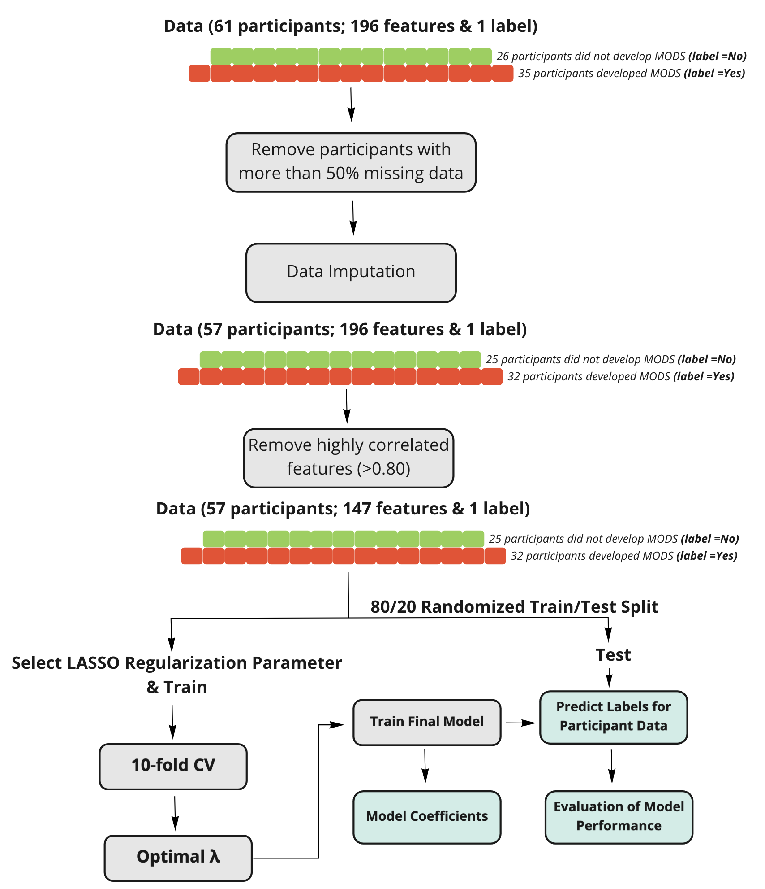

<style type="text/css">
.main-container {
  max-width: 1800px;
  margin-left: auto;
  margin-right: auto;
}
</style>

 * Term Paper
 * Fall 2021, DSPA (HS650)
 * Name: Safa Jabri
 * SID: #### - 6332 
 * UMich E-mail: safajb@umich.edu
 * I certify that the following paper represents my own independent work and conforms with the guidelines of academic honesty described in the UMich student handbook.

```{r name0, message=FALSE, warning=FALSE, include=FALSE}
# Load libraries
library("betareg"); library("mi")
library("plotly")
library("Boruta")
library(glmnet)
library(arm)
library(knitr)
library(caret)
library("glmnet")
library(C50)
library(corrplot)
library(ROCit)

# Defined functions:

draw_confusion_matrix <- function(cm) {

  layout(matrix(c(1,1,2)))
  par(mar=c(2,2,2,2))
  plot(c(100, 345), c(300, 450), type = "n", xlab="", ylab="", xaxt='n', yaxt='n')
  title('CONFUSION MATRIX', cex.main=2)

  # create the matrix 
  rect(150, 430, 240, 370, col='#3F97D0')
  text(195, 435, 'Label = No', cex=1.2)
  rect(250, 430, 340, 370, col='#F7AD50')
  text(295, 435, 'Label = Yes', cex=1.2)
  text(125, 370, 'Predicted', cex=1.3, srt=90, font=2)
  text(245, 450, 'Actual', cex=1.3, font=2)
  rect(150, 305, 240, 365, col='#F7AD50')
  rect(250, 305, 340, 365, col='#3F97D0')
  text(140, 400, 'Label = No', cex=1.2, srt=90)
  text(140, 335, 'Label = Yes', cex=1.2, srt=90)

  # add in the cm results 
  res <- as.numeric(cm$table)
  text(195, 400, res[1], cex=1.6, font=2, col='white')
  text(195, 335, res[2], cex=1.6, font=2, col='white')
  text(295, 400, res[3], cex=1.6, font=2, col='white')
  text(295, 335, res[4], cex=1.6, font=2, col='white')

  # add in the specifics 
  plot(c(100, 0), c(100, 0), type = "n", xlab="", ylab="", main = "DETAILS", xaxt='n', yaxt='n')
  text(10, 85, names(cm$byClass[1]), cex=1.2, font=2)
  text(10, 70, round(as.numeric(cm$byClass[1]), 3), cex=1.2)
  text(30, 85, names(cm$byClass[2]), cex=1.2, font=2)
  text(30, 70, round(as.numeric(cm$byClass[2]), 3), cex=1.2)
  text(50, 85, names(cm$byClass[5]), cex=1.2, font=2)
  text(50, 70, round(as.numeric(cm$byClass[5]), 3), cex=1.2)
  text(70, 85, names(cm$byClass[6]), cex=1.2, font=2)
  text(70, 70, round(as.numeric(cm$byClass[6]), 3), cex=1.2)
  text(90, 85, names(cm$byClass[7]), cex=1.2, font=2)
  text(90, 70, round(as.numeric(cm$byClass[7]), 3), cex=1.2)

  # add in the accuracy information 
  text(30, 35, names(cm$overall[1]), cex=1.5, font=2)
  text(30, 20, round(as.numeric(cm$overall[1]), 3), cex=1.4)
  text(70, 35, names(cm$overall[2]), cex=1.5, font=2)
  text(70, 20, round(as.numeric(cm$overall[2]), 3), cex=1.4)
}  

```

# Abstract
Multiple organ Dysfunction Syndrome (MODS) is a syndrome that occurs in 30-40% of trauma patients and is characterized by the dysfunction and, in acute cases,failure of more than one organ. The early detection or prediction of the occurrence of MODS can help clinicians identify patients in need of monitoring and specialized care. The goal of this project is to develop a model to predict the development of MODS in trauma patients based on early measures of immunological biomarkers and clinical assessments within the first 72h from injury.<br />

A publicly available dataset collected through blood samples from 61 adult trauma patients at three different time points (<1h, 4–12h, 48–72h) after injury along with a label designating whether they developed MODS. The dataset was preprocessed to remove or impute missing data then randomly split into training and testing data following and 80-20 split. <br />

Based on this dataset, we built four general linear modesl with LASSO regularization (with 10-fold cv) to predict MODS in trauma patients within 1h, within 12h, within 72h of traumatic injury based on immunological biomarkers levels collected from blood samples as well as clinical assessment scores for survival and injury severity. For each model performance was assessed based on conventional metrics (accuracy, sensitivity, specificity, confusion matrice, area under the receiver operating curve AUROC) and predictive features included in the highest performing model were identified.<br />

This work shows preliminary evidence of the predictive power of biomarkers and clinical measures in the first 72 hours after injury in the context of MODS using simple general linear models. In order to assess the generalizability of these methods, additional data should be collected from a larger patient population.<br />

# Introduction 
Multiple organ Dysfunction Syndrome (MODS) is a life-threatening syndrome whereby more than one organ exhibits signs of altered function[1] that may lead to their failure. MODS generally occurs as a complication among 30-40% of traumatic injury patients and patients admitted to intensive care units (ICU)[2], accounting for up to 50% of ICU deaths[3].
The syndrome's complex pathological and physiological mechanisms are not fully understood, as there are multiple pathways that may lead to the failure of multiple organs[2] but it is thought to be usually caused by uncontrolled immune response leading to uncontrolled inflammation[4], similar to sepsis and systemic inflammatory response syndrome (SIRS). <br />

Typically, MODS is assessed by clinicians by looking at trends in patients' vital signs and examining various organs for signs of dysfunction, but early detection of the syndrome can be crucial in preventing its progression to life-threatening organ failure. A proposed way to detect MODS early, is to examine the early immune response to trauma to predict the occurrence of uncontrolled inflammation and organ dysfunction. The Golden Hour study[2,5] aimed to achieve this by analyzing the very early, within 1-hour of and up to 72 hours after trauma, response of the immune system to examine the relationship between levels of immunological biomarkers and the development of MODS (hence the name of the project).<br />

## Hypothesis
We hypothesize that immunological biomarkers detected within 72 hours after trauma can predict the development of Multiple Organ Dysfunction Syndrome (MODS). 

# Methods
## Dataset
The analysis is based on a public dataset of immunological response measurements[6], collected by Bravo-Merodio et al. (2019)[2]. The immune and inflammatory response to trauma was collected through blood samples from 61 adult trauma patients at three different time points (<1h, 4–12h, 48–72h). <br />
For each patient immunological and clinical parameters with the immunological variables belonging to the following categories were collected: neutrophil functional analysis (response to formyl-methionine-leucine-phenylalanine (fMLF)), monocyte response to lipopolysaccharides (LPS) stimulation, haematological, cfDNA analysis and serum analysis (cytokines and cortisol).<br />
In addition, patients' New Injury Severity Score (NISS), assessing the combined effects of injuries in multiply-injured patients was also recorded, as well as Population Survival (PS14) values evaluating survival and mortality after traumatic injury.<br />
Finally a binary label indicating the development of MODS within each patient was also collected. 
A full list of all features included in the dataset is available in the Appendix section. <br />

## Analysis
The goal of this analysis was to build and assess the performance of machine learning (ML) models to predict labels indicating the development of MODS in patients of traumatic injury. A secondary goal is to identify features that best predict the development of MODS. <br />
To achieve this goal the following steps were undertaken to analyze the data:

### Data Pre-processing: Assessing and Handeling Missing Data
To prepare the data for analysis, we first assessed the quality of the publicly available dataset by evaluating its missingness using the R library "mi". Patients with less than 50% of features available were first eliminated, then the rest of the missing data was imputed using the function mi(). <br />
Summary statistics of the dataset before and after imputation are provided.<br />

### Bulding a Predictive Models of MODS

In order to assess our ability to predict MODS through immunological biomarkers (within <1h, 4–12h, 48–72h) and the NISS and PS14 injury severity and survival scores, I built 4 predictive models using the linear classifier gmlnet() to assess the predictive power of the model as more information is gathered about patients throughout time. The 4 models include the following data:

* Model 1: Predicting MODS with data only from the first 1h after injury (includes only immunological biomarker levels from blood samples from data collections at T1 (<1h) and no NISS or PS14 scores)

* Model 2: Predicting MODS with data only from the first 12h after injury (includes only immunological biomarker levels from blood samples from data collections at T1 (<1h) and T2 (4-12h) and no NISS or PS14 scores)

* Model 3: Predicting MODS with data only from the first 72h after injury (includes only immunological biomarker levels from blood samples from data collections at T1 (<1h) , T2 (4-12h) and T3 (48-72h) and no NISS or PS14 scores)

* Model 4: Predicting MODS with data all of the data gathered y (includes only immunological biomarker levels from blood samples from data collections at T1 (<1h) , T2 (4-12h) and T3 (48-72h), as well as NISS and PS14 scores)

<br />

Each of the models was built following the steps outlined below:

#### Step 1: Removing Highly Correlated Features

Due to the high-dimensionality of the dataset (197 variables, for 61 patients), it was important that we reduced dimentionality of the model. We first start by calculating the correlation matrix for all features and eliminating highly-correlated variables (>0.80). <br />
In order to build and evaluate a predictive model of the development of MODS in trauma patients, we split the pre-processed, now complete, dataset into training and testing sets (80% training and 20% testing). <br />

#### Step 2: Model Training with LASSO Regularization 

A linear algorithm with Least Absolute Shrinkage and Selection Operator (LASSO) regularization was then used to train the model on the training set. <br />
By penalizing the sum of the absolute values of the regression coefficients, LASSO regularization allows for automatic feature selection by shrinking coefficients of inimportant features, thus reducing the dimensionality of the model. LASSO regularization parameter $\lambda$ was selected following a 10-fold cross-validation scheme to optimize prediction performance. To reduce the variability in model performance due to the variability of lambdas selected with each run of the cross-validation, the optimal$\lambda$ was selected by averaging lambda.1se values for 100 repeated runs of cv.glmnet() <br />

#### Step 3: Model Assessment 
To assess the performance of the model, we predicted the MODS labels of patients from the testing set using the trained model and reported the confusion matrix. <br />
In addition, we plotted the Receiver-Operating Characteristic curve (ROC) and reported the Area Under the Receiver-Operating Characteristic curve (AUROC). <br />

An overview of methods is shown below (for Model 4)
```{r pressure, echo=FALSE, fig.cap="Overview of methods", out.width = '100%'}

```
# Results

## Dataset Visualization 

<br /> The publicly available dataset included 61 patients between 18-90 years old. The distribution of the patients' ages can be found in the figure below: <br />
```{r name1, echo=FALSE, message=FALSE, warning=FALSE}
#Load data
raw_dataset<- (as.data.frame(read.csv("/Users/safajebri/Dropbox (University of Michigan)/from_box/Year 3/HS650/Term Paper/InFlamUOB-NSDTraumaMODS-04b227c/FinalDatasetPS14.csv", header = TRUE)))
summary(raw_dataset$Age)
x<-raw_dataset$Age
fit <- density(x)
plot_ly(x = x, type = "histogram", name = "Data Histogram", histnorm = "probability") %>% 
    add_trace(x = fit$x, y = fit$y, type = "scatter", mode = "lines", opacity=0.1,
              fill = "tozeroy", yaxis = "y2", name = "Density") %>% 
  
    layout(title='Histogram, Density Estimate of Patient Ages', 
           yaxis2 = list(overlaying = "y", side = "right"),
           legend = list(orientation = 'h'))
```
<br /> The distribution of MODS labels among the 61 patients can be seen in the figure below; 35 of the 61 patients (57.4%) developed MODS while 26 did not (42.6%) <br /> 
```{r name2, echo=FALSE, message=FALSE, warning=FALSE}
label_proportion<-table(raw_dataset$Label )
plot_ly(x = raw_dataset$Label, type = "histogram", name = "Data Histogram", histnorm = "probability") %>% 
  
    layout(title='Histogram of Patient Labels', 
           yaxis2 = list(overlaying = "y", side = "right"),
           legend = list(orientation = 'h'))
```
### Data Pre-processing: Assessing and Handeling Missing Data
<br /> The unprocessed dataset was missing 13.6% of its data, we can visualize missing values in the image below. We can see in the image that a few observations account for most of the missing data, as the dark boxes representing missing data stretched horizontally. <br />
```{r name3, message=FALSE, warning=FALSE, include=FALSE}
#(sum(is.na(raw_dataset))/prod(dim(raw_dataset)))*100
# Visualize missingness
mdf<- missing_data.frame(raw_dataset)
```

```{r name3.1, echo=FALSE, message=FALSE, warning=FALSE}
image(mdf)
```
<br /> After removing patients (or observations) where 50% or more of the data is missing, we reduce the dataset from 61 to 57 observations and reduce the percentage of missing data to 10.5% <br />
```{r name4, message=FALSE, warning=FALSE, include=FALSE}
## Remove rows with more than 50% NA
reduced_dataset<- raw_dataset[which(rowMeans(!is.na(raw_dataset)) > 0.50), ]
mdf<- missing_data.frame(reduced_dataset)
```

```{r name4.1, echo=FALSE, message=FALSE, warning=FALSE}
image(mdf)
#(sum(is.na(reduced_dataset))/prod(dim(reduced_dataset)))*100
```
<br /> The reduced dataset (57 patients x 197 variables) was then completed via imputation. Visualization plots of some of the variables are listed below to examine their distributions, relative to the original distributions in the raw dataset:
```{r name5, message=FALSE, warning=FALSE, include=FALSE}
reduced_dataset<- reduced_dataset[ ,!(names(reduced_dataset)%in%c("X..TLR2..ve_T3"))]

Df<-reduced_dataset[ , 1:30]
mdf<- missing_data.frame(Df)
#image(mdf)
imputations <- mi(mdf, n.iter=5, n.chains=5, verbose=TRUE)
Df_completed1 <- complete(imputations, 5)
#image(missing_data.frame(Df_completed1$`chain:5`[1:30]))


Df<-reduced_dataset[ , 31:60]
mdf<- missing_data.frame(Df)
imputations <- mi(mdf, n.iter=5, n.chains=5, verbose=TRUE)
Df_completed2 <- complete(imputations, 5)
#image(missing_data.frame(Df_completed2$`chain:5`[1:30]))

Df<-reduced_dataset[ , 61:90]
mdf<- missing_data.frame(Df)
imputations <- mi(mdf, n.iter=5, n.chains=5, verbose=TRUE)
Df_completed3 <- complete(imputations, 5)

Df<-reduced_dataset[ , 91:120]
mdf<- missing_data.frame(Df)
imputations <- mi(mdf, n.iter=5, n.chains=5, verbose=TRUE)
Df_completed4 <- complete(imputations, 5)

Df<-reduced_dataset[ , 121:150]
mdf<- missing_data.frame(Df)
imputations <- mi(mdf, n.iter=5, n.chains=5, verbose=TRUE)
Df_completed5 <- complete(imputations, 5)

Df<-reduced_dataset[ , 151:180]
mdf<- missing_data.frame(Df)
imputations <- mi(mdf, n.iter=5, n.chains=5, verbose=TRUE)
Df_completed6 <- complete(imputations, 5)

Df<-reduced_dataset[ , 181:195]
mdf<- missing_data.frame(Df)
imputations <- mi(mdf, n.iter=5, n.chains=5, verbose=TRUE)
Df_completed7 <- complete(imputations, 5)
```
```{r name6, echo=FALSE, message=FALSE, warning=FALSE}
Label <- factor(reduced_dataset$Label)
complete_dataset <- data.frame(Df_completed1$`chain:5`[1:30],Df_completed2$`chain:5`[1:30],Df_completed3$`chain:5`[1:30],Df_completed4$`chain:5`[1:30],Df_completed5$`chain:5`[1:30],Df_completed6$`chain:5`[1:30],Df_completed7$`chain:5`[1:15],Label)

image(missing_data.frame(complete_dataset))

#show(missing_data.frame(complete_dataset))
```
<br /> The distribution of MODS labels among the 57 patients can be seen in the figure below; 32 of the 57 patients (56.1%) developed MODS while 25 did not (43.9%). The distribution of labels was roughly maintained. <br />
```{r name7, echo=FALSE, message=FALSE, warning=FALSE}
label_proportion<-table(complete_dataset$Label )
plot_ly(x = complete_dataset$Label, type = "histogram", name = "Data Histogram", histnorm = "probability") %>% 
  
    layout(title='Histogram of Patient Labels', 
           yaxis2 = list(overlaying = "y", side = "right"),
           legend = list(orientation = 'h'))
```

<br /> QQ plots below show the relationship between the original and imputed distribution of the data for some examples of features. Distributions were roughly maintained after the imputation of missing data. <br />

```{r name8, echo=FALSE, message=FALSE, warning=FALSE}
# check visually for differences between the distributions of the raw (input) and rebalanced data (for only ALFRS_Total_median, in this case)
QQ1<- qqplot(raw_dataset$CD56BRIGHT.NK.cells..x106.L._T1, complete_dataset$CD56BRIGHT.NK.cells..x106.L._T1, plot.it=F)

fig1<-plot_ly(x=~QQ1$x, y = ~QQ1$y, type="scatter", mode="markers", showlegend=F) %>%
  add_lines(x=c(0,80), y=c(0,80), showlegend=F) %>%
  layout(title="QQ-Plot Original vs. Imputed Data for CD56BRIGHT.NK.cells..x106.L._T1", xaxis=list(title="original data"),
         yaxis=list(title="Imputed data"))

QQ2 <- qqplot(raw_dataset$TLR4..MedFI._T1, complete_dataset$TLR4..MedFI._T1, plot.it=F)
fig2<-plot_ly(x=~QQ2$x, y = ~QQ2$y, type="scatter", mode="markers", showlegend=F) %>%
  add_lines(x=c(0,20), y=c(0,20), showlegend=F) %>%
  layout(title="QQ-Plot Original vs. Imputed Data for TLR4..MedFI._T1", xaxis=list(title="original data"),
         yaxis=list(title="Imputed data"))

QQ3 <- qqplot(raw_dataset$MONO.._T2, complete_dataset$MONO.._T2, plot.it=F)
fig3<-plot_ly(x=~QQ3$x, y = ~QQ3$y, type="scatter", mode="markers", showlegend=F) %>%
  add_lines(x=c(0,20), y=c(0,20), showlegend=F) %>%
  layout(title="QQ-Plot Original vs. Imputed Data for MONO.._T2", xaxis=list(title="original data"),
         yaxis=list(title="Imputed data"))

QQ4 <- qqplot(raw_dataset$CD86..MedFI._T3, complete_dataset$CD86..MedFI._T3, plot.it=F)
fig4<-plot_ly(x=~QQ4$x, y = ~QQ4$y, type="scatter", mode="markers", showlegend=F) %>%
  add_lines(x=c(0,90), y=c(0,90), showlegend=F) %>%
  layout(title="QQ-Plot Original vs. Imputed Data for TLR4..MedFI._T1", xaxis=list(title="original data"),
         yaxis=list(title="Imputed data"))

fig <- subplot(fig1, fig2, fig3, fig4, nrows = 2) %>% 
  layout(title = 'QQ plots for Imputed Variables')
annotations = list( 
  list( 
    x = 0.2,  
    y = 1.0,  
    text = "QQ plot for CD56BRIGHT.NK.cells..x106.L._T1",  
    xref = "paper",  
    yref = "paper",  
    xanchor = "center",  
    yanchor = "bottom",  
    showarrow = FALSE 
  ),  
  list( 
    x = 0.8,  
    y = 1,  
    text = "QQ plot for TLR4..MedFI._T1 levels ",  
    xref = "paper",  
    yref = "paper",  
    xanchor = "center",  
    yanchor = "bottom",  
    showarrow = FALSE 
  ),  
  list( 
    x = 0.2,  
    y = 0.45,  
    text = "QQ plot for MONO.._T2 levels",  
    xref = "paper",  
    yref = "paper",  
    xanchor = "center",  
    yanchor = "bottom",  
    showarrow = FALSE 
  ),
  list( 
    x = 0.8,  
    y = 0.45,  
    text = "Q plot for CD86..MedFI._T3 levels ",  
    xref = "paper",  
    yref = "paper",  
    xanchor = "center",  
    yanchor = "bottom",  
    showarrow = FALSE 
  ))

fig <- fig %>%layout(annotations = annotations) 
#options(warn = -1)
fig

```
### Predictive Models of MODS

#### Model 1: Predicting MODS based on data from <1h after injury

The first model is based on data collected from blood samples taken within the first hour after traumatic injury occurred. In this analysis, we examine the predictive power of this very early measurement of the immune response at predicting MODS. 

The reduced dataset is composed of 57 patients (or observations) and 65 features, corresponding to 1 label as seen in the table below: 


Table 1. Dataset of immunological biomarkers collected <1h after traumatic injury 
```{r name11.00, echo=FALSE, message=FALSE, warning=FALSE}
library("DT")
early_features = complete_dataset[,4:68]
early_label = complete_dataset[,196]
early_dataset = data.frame(complete_dataset[,4:68],Label=complete_dataset[,196])

datatable(early_dataset)
```

##### Step 1: Removing Highly Corrleated Features

We calculated correlation values for all features in the model and remove highly correlated (>0.80) features as a first effort to reduce the dimentionality of the model. After removing the correlated features (shown in the correlation plot below), the dataset is reduced from 65 features to 54 features. <br />
11 features were found to be highly correlated with other features in the model (and thus introducing little information to the model) and were therefore removed. An overview of the correlation matrix produced after highly correlated features were removed is shown below. We can see that there are no highly correlated features in the dataset anymore. <br />

```{r name11.01, echo=FALSE, message=FALSE, warning=FALSE}
set.seed(1234)

M <- cor(data.matrix(early_features))
M[upper.tri(M)] <- 0
diag(M) <- 0
 
data.new <- early_features[, !apply(M, 2, function(x) any(abs(x) > 0.80, na.rm = TRUE))]
Label<-early_label
reduce_dataset <- data.frame(data.new,Label)

M <- cor(data.matrix(data.new))
M[upper.tri(M)] <- 0
diag(M) <- 0
corrplot(M,is.corr=FALSE, tl.col="black", na.label=" ",tl.cex=0.4,tl.srt = 70 )

##
train = sample(1:nrow(reduce_dataset),0.8*nrow(reduce_dataset))
training_dataset = reduce_dataset[train,]

testing_dataset = reduce_dataset[-train,]

training_features = training_dataset[, 1:length(reduce_dataset)-1]
training_labels = training_dataset[, length(reduce_dataset)]

testing_features = testing_dataset[, 1:length(reduce_dataset)-1]
testing_labels = testing_dataset[, length(reduce_dataset)]

```

##### Step 2: Linear Model with LASSO Regularization 

<br /> After splitting the pre-processed dataset into a training set and a test set, we used 10-fold cross validation to determine the optimal LASSO regularization parameter $\lambda$ to minimize binomial deviance of a general linear model. <br />

We then fit the final linear model he optimal LASSO regularization parameter $\lambda$ (following 1se method) to the training data. 

```{r name11.02, echo=FALSE, message=FALSE, warning=FALSE}
#### 10-fold cross validation ####

cv.lasso <- lapply(1:1000, function(i) { cv.glmnet(data.matrix(training_features),training_labels, standardize=TRUE, type.measure='mse',family = "binomial") })
mylambda <- sapply(cv.lasso, '[[', "lambda.1se")

model <- glmnet(data.matrix(training_features),training_labels, alpha = 1, family = "binomial", lambda = mean(mylambda))
```

##### Step 3: Model Assessment

The bar plot below shows the features assigned a non-zero coefficient in the final mode. LASSO regularization shrunk the model by assigning zero coefficients to certain features. We can see that out of the 54 features initially introduced to the model, fewer than 10 variables had non-zero coefficients. <br />
<br />

```{r name11.03, echo=FALSE, message=FALSE, warning=FALSE}
coefficients<-data.frame(names=c(rownames(coef(model, s = 'lambda.min'))),coef=c(coef(model, s = 'lambda.min')[,1]))

nonzero <- data.frame(names=c(rownames(coef(model, s = 'lambda.min'))[coef(model, s = 'lambda.min')[,1]!= 0] ), coef=c(coef(model, s = 'lambda.min')[coef(model, s = 'lambda.min')[,1]!= 0]))

nonzero$names <- factor(nonzero$names, levels = unique(nonzero$names)[order(abs(nonzero$coef), decreasing = TRUE)])
plot_ly(nonzero, x = ~names, y = ~coef, type = 'bar')%>%
  layout(title="Linear Model Non-Zero Coefficients", xaxis=list(title="Features"),
         yaxis=list(title="Coefficient"))


l=levels(nonzero$names)
```

<br />
We then use the linear model to predict labels for individuals from the test set. We plot below below the confusion matrix and ROC curve, and report the AUROC and performance measures at a classification threshold of 0.5 <br />
The ROC curve shows the tradeoff between the False Positive Rate (FPR) and True Positive Rate (TPR) in the model. <br /> 
The model's prefrormance metrics can be seen blow. The model based on data for the first hour after traumatic injury shows that the model wasn't particularly good at predicting MODS <br /> 

```{r name11.04, echo=FALSE, message=FALSE, warning=FALSE}
# Make predictions on the test data
probabilities <- model %>% predict(newx = data.matrix(testing_features))
predicted.classes <- ifelse(probabilities > 0.5, "Y", "N")
# Model accuracy
observed.classes <- testing_labels
data<-factor(predicted.classes)
cm <-confusionMatrix(data,observed.classes)

draw_confusion_matrix(cm)


ROCit_obj <- rocit(score= as.numeric(probabilities),class=observed.classes)
summary(ROCit_obj)
plot(ROCit_obj)

```

#### Model 2: Predicting MODS based on data from the first 12h after injury

The first model is based on data collected from blood samples taken within the first 12 hours after traumatic injury occurred. In this analysis, we examine the predictive power of measurements of the immune response within 12h from injury at predicting MODS. 

The reduced dataset is composed of 57 patients (or observations) and 129 features, corresponding to 1 label as seen in the table below: 


Table 2. Dataset of immunological biomarkers collected within 12h after traumatic injury 
```{r name11.000, echo=FALSE, message=FALSE, warning=FALSE}
library("DT")
early_features = complete_dataset[,4:132]
early_label = complete_dataset[,196]
early_dataset = data.frame(complete_dataset[,4:132],Label=complete_dataset[,196])

datatable(early_dataset)
```

##### Step 1: Removing Highly Corrleated Features

We calculated correlation values for all features in the model and remove highly correlated (>0.80) features as a first effort to reduce the dimentionality of the model. After removing the correlated features (shown in the correlation plot below), the dataset is reduced from 129 features to 107 features. <br />
22 features were found to be highly correlated with other features in the model (and thus introducing little information to the model) and were therefore removed. An overview of the correlation matrix produced after highly correlated features were removed is shown below. We can see that there are no highly correlated features in the dataset anymore. <br />

```{r name11.001, echo=FALSE, message=FALSE, warning=FALSE}
set.seed(1234)

M <- cor(data.matrix(early_features))
M[upper.tri(M)] <- 0
diag(M) <- 0
 
data.new <- early_features[, !apply(M, 2, function(x) any(abs(x) > 0.80, na.rm = TRUE))]
Label<-early_label
reduce_dataset <- data.frame(data.new,Label)

M <- cor(data.matrix(data.new))
M[upper.tri(M)] <- 0
diag(M) <- 0
corrplot(M,is.corr=FALSE, tl.col="black", na.label=" ",tl.cex=0.4,tl.srt = 70 )

##
train = sample(1:nrow(reduce_dataset),0.8*nrow(reduce_dataset))
training_dataset = reduce_dataset[train,]

testing_dataset = reduce_dataset[-train,]

training_features = training_dataset[, 1:length(reduce_dataset)-1]
training_labels = training_dataset[, length(reduce_dataset)]

testing_features = testing_dataset[, 1:length(reduce_dataset)-1]
testing_labels = testing_dataset[, length(reduce_dataset)]

```

##### Step 2: Linear Model with LASSO Regularization 

<br /> After splitting the pre-processed dataset into a training set and a test set, we used 10-fold cross validation to determine the optimal LASSO regularization parameter $\lambda$ to minimize binomial deviance of a general linear model. <br />

We then fit the final linear model he optimal LASSO regularization parameter $\lambda$ (following 1se method) to the training data. 

```{r name11.002, echo=FALSE, message=FALSE, warning=FALSE}
#### 10-fold cross validation ####

cv.lasso <- lapply(1:1000, function(i) { cv.glmnet(data.matrix(training_features),training_labels, standardize=TRUE, type.measure='mse',family = "binomial") })
mylambda <- sapply(cv.lasso, '[[', "lambda.1se")

model <- glmnet(data.matrix(training_features),training_labels, alpha = 1, family = "binomial", lambda = mean(mylambda))
```

##### Step 3: Model Assessment

The bar plot below shows the features assigned a non-zero coefficient in the final mode. LASSO regularization shrunk the model by assigning zero coefficients to certain features. We can see that out of the 107 features initially introduced to the model, again fewer than 10 features had non-zero coefficients. <br />
<br />

```{r name11.003, echo=FALSE, message=FALSE, warning=FALSE}
coefficients<-data.frame(names=c(rownames(coef(model, s = 'lambda.min'))),coef=c(coef(model, s = 'lambda.min')[,1]))

nonzero <- data.frame(names=c(rownames(coef(model, s = 'lambda.min'))[coef(model, s = 'lambda.min')[,1]!= 0] ), coef=c(coef(model, s = 'lambda.min')[coef(model, s = 'lambda.min')[,1]!= 0]))

nonzero$names <- factor(nonzero$names, levels = unique(nonzero$names)[order(abs(nonzero$coef), decreasing = TRUE)])
plot_ly(nonzero, x = ~names, y = ~coef, type = 'bar')%>%
  layout(title="Linear Model Non-Zero Coefficients", xaxis=list(title="Features"),
         yaxis=list(title="Coefficient"))


l=levels(nonzero$names)
```

<br />
We then use the linear model to predict labels for individuals from the test set. We plot below below the confusion matrix and ROC curve, and report the AUROC and performance measures at a classification threshold of 0.5 <br />
The ROC curve shows the tradeoff between the False Positive Rate (FPR) and True Positive Rate (TPR) in the model. <br /> 
The model's prefrormance metrics can be seen blow. The model based on data for the first hour after traumatic injury shows that the model wasn't particularly good at predicting MODS <br /> 

```{r name11.004, echo=FALSE, message=FALSE, warning=FALSE}
# Make predictions on the test data
probabilities <- model %>% predict(newx = data.matrix(testing_features))
predicted.classes <- ifelse(probabilities > 0.5, "Y", "N")
# Model accuracy
observed.classes <- testing_labels
data<-factor(predicted.classes)
cm <-confusionMatrix(data,observed.classes)

draw_confusion_matrix(cm)


ROCit_obj <- rocit(score= as.numeric(probabilities),class=observed.classes)
summary(ROCit_obj)
plot(ROCit_obj)

```

#### Model 3: Predicting MODS based on data from the first 72h after injury

The third model is based on data collected from blood samples taken within 72 hours after traumatic injury occurred. In this analysis, we examine the predictive power of all measurements of the immune response  at predicting MODS. 

The reduced dataset is composed of 57 patients (or observations) and 192 features, corresponding to 1 label as seen in the table below: 


Table 3. Dataset of immunological biomarkers collected within 72h after traumatic injury 
```{r name11.0000, echo=FALSE, message=FALSE, warning=FALSE}
library("DT")
early_features = complete_dataset[,4:195]
early_label = complete_dataset[,196]
early_dataset = data.frame(complete_dataset[,4:195],Label=complete_dataset[,196])

datatable(early_dataset)
```

##### Step 1: Removing Highly Corrleated Features

We calculated correlation values for all features in the model and remove highly correlated (>0.80) features as a first effort to reduce the dimentionality of the model. After removing the correlated features (shown in the correlation plot below), the dataset is reduced from 192 features to 159 features. <br />
33 features were found to be highly correlated with other features in the model (and thus introducing little information to the model) and were therefore removed. An overview of the correlation matrix produced after highly correlated features were removed is shown below. We can see that there are no highly correlated features in the dataset anymore. <br />

```{r name11.0001, echo=FALSE, message=FALSE, warning=FALSE}
set.seed(1234)

M <- cor(data.matrix(early_features))
M[upper.tri(M)] <- 0
diag(M) <- 0
 
data.new <- early_features[, !apply(M, 2, function(x) any(abs(x) > 0.80, na.rm = TRUE))]
Label<-early_label
reduce_dataset <- data.frame(data.new,Label)

M <- cor(data.matrix(data.new))
M[upper.tri(M)] <- 0
diag(M) <- 0
corrplot(M,is.corr=FALSE, tl.col="black", na.label=" ",tl.cex=0.4,tl.srt = 70 )

##
train = sample(1:nrow(reduce_dataset),0.8*nrow(reduce_dataset))
training_dataset = reduce_dataset[train,]

testing_dataset = reduce_dataset[-train,]

training_features = training_dataset[, 1:length(reduce_dataset)-1]
training_labels = training_dataset[, length(reduce_dataset)]

testing_features = testing_dataset[, 1:length(reduce_dataset)-1]
testing_labels = testing_dataset[, length(reduce_dataset)]

```

##### Step 2: Linear Model with LASSO Regularization 

<br /> After splitting the pre-processed dataset into a training set and a test set, we used 10-fold cross validation to determine the optimal LASSO regularization parameter $\lambda$ to minimize binomial deviance of a general linear model. <br />

We then fit the final linear model he optimal LASSO regularization parameter $\lambda$ (following 1se method) to the training data. 

```{r name11.0002, echo=FALSE, message=FALSE, warning=FALSE}
#### 10-fold cross validation ####

cv.lasso <- lapply(1:1000, function(i) { cv.glmnet(data.matrix(training_features),training_labels, standardize=TRUE, type.measure='mse',family = "binomial") })
mylambda <- sapply(cv.lasso, '[[', "lambda.1se")

model <- glmnet(data.matrix(training_features),training_labels, alpha = 1, family = "binomial", lambda = mean(mylambda))
```

##### Step 3: Model Assessment

The bar plot below shows the features assigned a non-zero coefficient in the final mode. LASSO regularization shrunk the model by assigning zero coefficients to certain features. We can see that out of the 159 features initially introduced to the model, again fewer than 10 features had non-zero coefficients. <br />
<br />

```{r name11.0003, echo=FALSE, message=FALSE, warning=FALSE}
coefficients<-data.frame(names=c(rownames(coef(model, s = 'lambda.min'))),coef=c(coef(model, s = 'lambda.min')[,1]))

nonzero <- data.frame(names=c(rownames(coef(model, s = 'lambda.min'))[coef(model, s = 'lambda.min')[,1]!= 0] ), coef=c(coef(model, s = 'lambda.min')[coef(model, s = 'lambda.min')[,1]!= 0]))

nonzero$names <- factor(nonzero$names, levels = unique(nonzero$names)[order(abs(nonzero$coef), decreasing = TRUE)])
plot_ly(nonzero, x = ~names, y = ~coef, type = 'bar')%>%
  layout(title="Linear Model Non-Zero Coefficients", xaxis=list(title="Features"),
         yaxis=list(title="Coefficient"))


l=levels(nonzero$names)
```

<br />
We then use the linear model to predict labels for individuals from the test set. We plot below below the confusion matrix and ROC curve, and report the AUROC and performance measures at a classification threshold of 0.5 <br />
The ROC curve shows the tradeoff between the False Positive Rate (FPR) and True Positive Rate (TPR) in the model. <br /> 
The model's prefrormance metrics can be seen blow. The model based on data for the first hour after traumatic injury shows that the model wasn't particularly good at predicting MODS <br /> 

```{r name11.0004, echo=FALSE, message=FALSE, warning=FALSE}
# Make predictions on the test data
probabilities <- model %>% predict(newx = data.matrix(testing_features))
predicted.classes <- ifelse(probabilities > 0.5, "Y", "N")
# Model accuracy
observed.classes <- testing_labels
data<-factor(predicted.classes)
cm <-confusionMatrix(data,observed.classes)

draw_confusion_matrix(cm)


ROCit_obj <- rocit(score= as.numeric(probabilities),class=observed.classes)
summary(ROCit_obj)
plot(ROCit_obj)

```

#### Model 4: Predicting MODS based on all data gathered including PS14 and NISS scores 

The final model is based on data collected from blood samples taken within 72 hours after traumatic injury occurred, as well as clinical assessment scores (PS14 and NISS). In this analysis, we examine the predictive power of all measurements of the immune response and assessments of the severity of injury at predicting MODS. 

The reduced dataset is composed of 57 patients (or observations) and 192 features, corresponding to 1 label as seen in the table below: 


Table 4. Dataset of immunological biomarkers and cliniclal assessments collected with 72h after traumatic injury 
```{r name11.00000, echo=FALSE, message=FALSE, warning=FALSE}
library("DT")
early_features = complete_dataset[,1:195]
early_label = complete_dataset[,196]
early_dataset = data.frame(complete_dataset[,4:195],Label=complete_dataset[,196])

datatable(early_dataset)
```

##### Step 1: Removing Highly Corrleated Features

We calculated correlation values for all features in the model and remove highly correlated (>0.80) features as a first effort to reduce the dimentionality of the model. After removing the correlated features (shown in the correlation plot below), the dataset is reduced from 196 features to 147. <br />

```{r name9, echo=FALSE, message=FALSE, warning=FALSE}

set.seed(1234)

M <- cor(data.matrix(complete_dataset[,1:195]))
M[upper.tri(M)] <- 0
diag(M) <- 0
 
data.new <- 
  complete_dataset[, !apply(M, 2, function(x) any(abs(x) > 0.80, na.rm = TRUE))]
Label<-complete_dataset$Label
reduce_dataset <- data.frame(data.new,Label)

M <- cor(data.matrix(data.new))
M[upper.tri(M)] <- 0
diag(M) <- 0

corrplot(M,is.corr=FALSE, tl.col="black", na.label=" ",tl.cex=0.4,tl.srt = 70 )

```

##### Step 2: Linear Model with LASSO Regularization 

<br /> After splitting the pre-processed dataset into a training set and a test set, we used 10-fold cross validation to determine the optimal LASSO regularization parameter $\lambda$ to minimize binomial deviance of a general linear model. <br />

We then fit the final linear model he optimal LASSO regularization parameter $\lambda$ (following 1se method) to the training data. 

```{r name9.0, echo=FALSE, message=FALSE, warning=FALSE}
set.seed(1234)
train = sample(1:nrow(reduce_dataset),0.8*nrow(reduce_dataset))
training_dataset = reduce_dataset[train,]

testing_dataset = reduce_dataset[-train,]

training_features = training_dataset[, 1:length(reduce_dataset)-1]
training_labels = training_dataset[, length(reduce_dataset)]

testing_features = testing_dataset[, 1:length(reduce_dataset)-1]
testing_labels = testing_dataset[, length(reduce_dataset)]


#### 10-fold cross validation ####
# LASSO


# (10-fold) cross validation for the LASSO

cv.lasso <- lapply(1:100, function(i) { cv.glmnet(data.matrix(training_features),training_labels, standardize=TRUE, type.measure='mse',family = "binomial") })
mylambda <- sapply(cv.lasso, '[[', "lambda.1se")

#cvLASSO = cv.glmnet(data.matrix(training_features),training_labels, alpha = 1,family = "binomial",nfolds=45,type.measure="class")
#plot(cvLASSO)

#MSEs <- NULL
#for (i in 1:100){
#                 cv <- cv.glmnet(data.matrix(training_features), training_labels, alpha=1, nfolds=10,family = #"binomial")  
#                 MSEs <- cbind(MSEs, cv$cvm)
#             }
#  rownames(MSEs) <- cv$lambda
#  lambda.min <- as.numeric(names(which.min(rowMeans(MSEs))))

# Fit the final model on the training data
#model <- glmnet(data.matrix(training_features),training_labels, alpha = 1, family = "binomial",
#                lambda = cvLASSO$lambda.1se)
#model <- glmnet(data.matrix(training_features),training_labels, alpha = 1, family = "binomial",
#                lambda = lambda.min)

model <- glmnet(data.matrix(training_features),training_labels, alpha = 1, family = "binomial",
                lambda = mean(mylambda))
```

##### Step 3: Model Assessment

The bar plot below shows the features assigned a non-zero coefficient in the final mode. LASSO regularization shrunk the model by assigning zero coefficients to certain features. We can see that out of the 147 features initially introduced to the model, fewer than 20 variables have non-zero coefficients. <br />
<br />
The boxplot above showcases the distribution of patients that developed MODS and those who didn't among 8 of the features included in the model. We can see that patients with MODS tend to have lower PS14 scores indicating that their survival likelihood tends to be evaluated lower within the first 72h after injury. Patients who develop MODS also tended to score higher on the NISS assessment, indicating a higher severity of their injuries. 
<br />
```{r name9.01, echo=FALSE, message=FALSE, warning=FALSE}
coefficients<-data.frame(names=c(rownames(coef(model, s = 'lambda.min'))),coef=c(coef(model, s = 'lambda.min')[,1]))

nonzero <- data.frame(names=c(rownames(coef(model, s = 'lambda.min'))[coef(model, s = 'lambda.min')[,1]!= 0] ), coef=c(coef(model, s = 'lambda.min')[coef(model, s = 'lambda.min')[,1]!= 0]))

nonzero$names <- factor(nonzero$names, levels = unique(nonzero$names)[order(abs(nonzero$coef), decreasing = TRUE)])
plot_ly(nonzero, x = ~names, y = ~coef, type = 'bar')%>%
  layout(title="Linear Model Non-Zero Coefficients", xaxis=list(title="Features"),
         yaxis=list(title="Coefficient"))


l=levels(nonzero$names)

s<-l[1]
figu1<-plot_ly(training_dataset, y = ~training_dataset[ ,(names(training_dataset)%in%l[2])], color=~training_dataset$Label, type = "box") %>%
  layout(title = paste0("Boxplot of  ", s),
         xaxis=list(title="MODS"),yaxis=list(title=s))

s<-l[2]
figu2<-plot_ly(training_dataset, y = ~training_dataset[ ,(names(training_dataset)%in%l[3])], color=~training_dataset$Label, type = "box") %>%
  layout(title = paste0("Boxplot of  ", s),
         xaxis=list(title="MODS"),yaxis=list(title=s))

s<-l[3]
figu3<-plot_ly(training_dataset, y = ~training_dataset[ ,(names(training_dataset)%in%l[4])], color=~training_dataset$Label, type = "box") %>%
  layout(title = paste0("Boxplot of  ", s),
         xaxis=list(title="MODS"),yaxis=list(title=s))

s<-l[4]
figu4<-plot_ly(training_dataset, y = ~training_dataset[ ,(names(training_dataset)%in%l[5])], color=~training_dataset$Label, type = "box") %>%
  layout(title = paste0("Boxplot of  ", s),
         xaxis=list(title="MODS"),yaxis=list(title=s))

s<-l[5]
figu5<-plot_ly(training_dataset, y = ~training_dataset[ ,(names(training_dataset)%in%l[6])], color=~training_dataset$Label, type = "box") %>%
  layout(title = paste0("Boxplot of  ", s),
         xaxis=list(title="MODS"),yaxis=list(title=s))

s<-l[6]
figu6<-plot_ly(training_dataset, y = ~training_dataset[ ,(names(training_dataset)%in%l[7])], color=~training_dataset$Label, type = "box") %>%
  layout(title = paste0("Boxplot of  ", s),
         xaxis=list(title="MODS"),yaxis=list(title=s))
s<-l[7]
figu7<-plot_ly(training_dataset, y = ~training_dataset[ ,(names(training_dataset)%in%l[8])], color=~training_dataset$Label, type = "box") %>%
  layout(title = paste0("Boxplot of  ", s),
         xaxis=list(title="MODS"),yaxis=list(title=s))
s<-l[8]
figu8<-plot_ly(training_dataset, y = ~training_dataset[ ,(names(training_dataset)%in%l[9])], color=~training_dataset$Label, type = "box") %>%
  layout(title = paste0("Boxplot of  ", s),
         xaxis=list(title="MODS"),yaxis=list(title=s))

fig <- subplot(figu1, figu2, figu3, figu4,figu5,figu6,figu7,figu8 , nrows = 4, margin = 0.07)%>%
layout(title = 'Box plot of 8 variables included in the model with the non-zero coefficients')
annotations = list( 
  list( 
    x = 0.2,  
    y = 1,  
    text = paste0("Boxplot of  ", l[2]),  
    xref = "paper",  
    yref = "paper",  
    xanchor = "center",  
    yanchor = "bottom",  
    showarrow = FALSE 
  ),  
  list( 
    x = 0.8,  
    y = 1,  
    text = paste0("Boxplot of  ", l[3]),  
    xref = "paper",  
    yref = "paper",  
    xanchor = "center",  
    yanchor = "bottom",  
    showarrow = FALSE 
  ),  
  list( 
    x = 0.2,  
    y = 0.7,  
    text = paste0("Boxplot of  ", l[4]),  
    xref = "paper",  
    yref = "paper",  
    xanchor = "center",  
    yanchor = "bottom",  
    showarrow = FALSE 
  ),
  list( 
    x = 0.8,  
    y = 0.7,  
    text = paste0("Boxplot of  ", l[5]),  
    xref = "paper",  
    yref = "paper",  
    xanchor = "center",  
    yanchor = "bottom",  
    showarrow = FALSE 
  ),
  list( 
    x = 0.2,  
    y = 0.45,  
    text = paste0("Boxplot of  ", l[6]),  
    xref = "paper",  
    yref = "paper",  
    xanchor = "center",  
    yanchor = "bottom",  
    showarrow = FALSE 
  ),
  list( 
    x = 0.8,  
    y = 0.45,  
    text = paste0("Boxplot of  ", l[7]),  
    xref = "paper",  
    yref = "paper",  
    xanchor = "center",  
    yanchor = "bottom",  
    showarrow = FALSE 
  ),
  list( 
    x = 0.2,  
    y = 0.2,  
    text = paste0("Boxplot of  ", l[8]),  
    xref = "paper",  
    yref = "paper",  
    xanchor = "center",  
    yanchor = "bottom",  
    showarrow = FALSE 
  ),
  list( 
    x = 0.8,  
    y = 0.2,  
    text = paste0("Boxplot of  ", l[9]),  
    xref = "paper",  
    yref = "paper",  
    xanchor = "center",  
    yanchor = "bottom",  
    showarrow = FALSE ))

fig <- fig %>%layout(annotations = annotations) 
fig

```

<br />
We then use the linear model to predict labels for individuals from the test set. We plot below below the confusion matrix and ROC curve, and report the AUROC and performance measures at a classification threshold of 0.5 <br />
The ROC curve shows the tradeoff between the False Positive Rate (FPR) and True Positive Rate (TPR) in the model. <br /> 
The model was able to achieve an accuracy of 83.3% with 1 false positive prediction and 1 false negative prediction.<br /> 
```{r name9.1, echo=FALSE, message=FALSE, warning=FALSE}
# Make predictions on the test data
probabilities <- model %>% predict(newx = data.matrix(testing_features))
predicted.classes <- ifelse(probabilities > 0.5, "Y", "N")
# Model accuracy
observed.classes <- testing_labels
data<-factor(predicted.classes)
cm <-confusionMatrix(data,observed.classes)

draw_confusion_matrix(cm)

library(ROCit)
ROCit_obj <- rocit(score= as.numeric(probabilities),class=observed.classes)
summary(ROCit_obj)
plot(ROCit_obj)

```

# Conclusions and Discussion 

The early detection of MODS can facilitate the identification of traumatic injury patients in need of preventative and supportive care. In this project, we trained four linear models to predict the development of MODS among patients with traumatic injury based on early biomarkers and clinical assessments. <br />

Models based on immunological biomarker data collected within 1h and 12 hours from injury did not show much predictive power as reflected in their perfomrance metrics. The model including immunological biomarker data collected up to 72 hours after traumatic injury however was able to better predict MODS within this patient population. These findings show evidence that the immune response within the first 12 hrs may not hold signinficant information to predict the development of MODS, but monitoring immunological biomarkers for the first 72h may preove useful in identifying indivudals at risk of developing MODS. <br />


The linear model with LASSO regularization based on all of the data gathere from this dataset including clinical assessment score for injury severity (NISS) and survival (PS14) was able to predict the development of MODS with an accuracy of 83.3%. <br />

Feature selection was performed using LASSO regularization to penalize the model's complexity and shrink the model to only its most informative features. Two features played an important role in predicting the development of MODS within trauma patients, clinical measures such as PS14 and NISS scores. Other features as well relating to biomarkers outlined in the boxplots above. <br />

The model had relatively high specificity and sensitivity (>=0.80) as it had 2 false predictions (1 false positive and 1 false negative).These findings provide additional context for clinicians interpreting the results of such a predictive model, as it provides further insights into the types of errors produced by this model. <br />

This work shows preliminary evidence of the predictive power of biomarkers and clinical measures in the first 72 hours after injury in the context of MODS using simple general linear models.<br />

Limitation to this work include the small sample size. In order to assess the generalizability of these methods, additional data should be collected from a larger patient population. In addition, the lack of demographic information beyond age about the patients included in the dataset and the lack of information on the types of injuries suffered limit the types of analyses that can be performed and questions that can be answered. Further studies should examine the relationships between demographic data and injury types with the development of MODS to provide more insights into this complex syndrome. 

# Appendix 
Table 1. Raw dataset of physiological and clinical data from 61 patient (courtesy of Bravo-Merofio et al.[2,6])
```{r name10, echo=FALSE, message=FALSE, warning=FALSE}
library("DT")
datatable(raw_dataset)
```

# References
[1] Marshall, John C. The Multiple Organ Dysfunction Syndrome. Surgical Treatment: Evidence-Based and Problem-Oriented. Zuckschwerdt, 2001. https://www.ncbi.nlm.nih.gov/books/NBK6868/. <br />
<br /> 
[2] Bravo-Merodio, Laura, Animesh Acharjee, Jon Hazeldine, Conor Bentley, Mark Foster, Georgios V. Gkoutos, and Janet M. Lord. “Machine Learning for the Detection of Early Immunological Markers as Predictors of Multi-Organ Dysfunction.” Scientific Data 6, no. 1 (December 19, 2019): 328. https://doi.org/10.1038/s41597-019-0337-6. <br />
<br />
[3] Mayr, Viktoria D., Martin W. Dünser, Veronika Greil, Stefan Jochberger, Günter Luckner, Hanno Ulmer, Barbara E. Friesenecker, Jukka Takala, and Walter R. Hasibeder. “Causes of Death and Determinants of Outcome in Critically Ill Patients.” Critical Care (London, England) 10, no. 6 (2006): R154. https://doi.org/10.1186/cc5086. <br />
<br />
[4] Choudhary, Devendra, Hanmant Goykar, Dnyaneshwar Kalyane, Nimeet Desai, and Rakesh Kumar Tekade. “Chapter 3 - Dose, Dosage Regimen, and Dose Adjustment in Organ Failure.” In Biopharmaceutics and Pharmacokinetics Considerations, edited by Rakesh Kumar Tekade, 1:29–82. Advances in Pharmaceutical Product Development and Research. Academic Press, 2021. https://doi.org/10.1016/B978-0-12-814425-1.00004-8. <br />
<br />
[5] Hazeldine, Jon, David N. Naumann, Emma Toman, David Davies, Jonathan R. B. Bishop, Zhangjie Su, Peter Hampson, et al. “Prehospital Immune Responses and Development of Multiple Organ Dysfunction Syndrome Following Traumatic Injury: A Prospective Cohort Study.” PLOS Medicine 14, no. 7 (July 18, 2017): e1002338. https://doi.org/10.1371/journal.pmed.1002338. <br />
<br />
[6] In FlamUOB/NSDTraumaMODS: NSDTraumaMODS. Zenodo, https://doi.org/10.5281/zenodo.3546293 (2019). <br />
<br />


 

